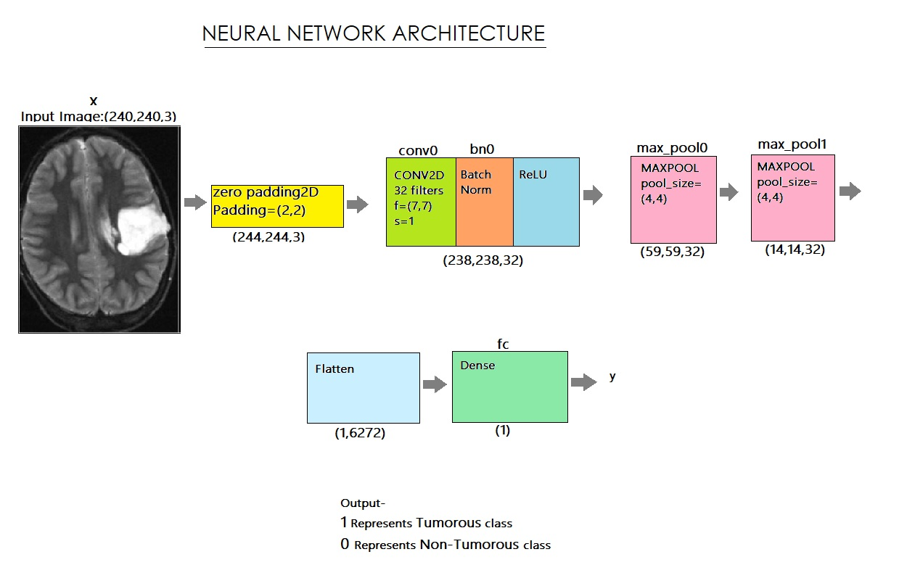

#  Brain tumor-detection using CNN
We downloaded datasets in the form of MRI scanned images from kaggle (https://www.kaggle.com/navoneel/brain-mri-images-for-brain-tumour-detection). The dataset includes 253 brain MRI images. We used data augmentation to make more images because we only had a few datasets. We also experienced a difficulty with an unequal distribution of tumorous and non-tumorous instances (55+ percent tumorous). In order to crop the area of the image that only contains the brain, we used a cropping approach to find the extreme top, bottom, left, and right points of the brain.
After reading each image, we cropped the section of the image that exclusively represented the brain. I then enlarged the image because the images in the dataset are of different sizes (in terms of width, height, and number of channels). We want all of our images to be digital in order to give it as an input to the neural network (240, 240, 3). Because we needed the pixel values to be scaled to a range of 0-1, we used normalisation. The label was added to y, and the image was added to X. We splitted the information into three categories: 80% instruction, 10% development, and 10% testing.
We developed the model, complied with that as well, and then trained it. Below is a diagram of the network architecture,

We carefully examined and charted the loss and accuracy of all the models before selecting the best one. We've loaded the most accurate model, which is in its 20th iteration and has a 90% validation accuracy. On test data, our algorithm detects brain tumours with 88% accuracy and an F1 Score of 89%.

## DATA AUGMENTATION
Information about Data
The dataset contains 253 brain MRI images in two folders: yes and no. Yes, there are 155 tumorous brain MRI images in the folder, and no, there are 98 non-tumorous brain MRI images in the folder. DATA SET SOURCE LINK here(https://www.kaggle.com/navoneel/brain-mri-images-for-brain-tumor-detection).

We are using data augmentation to create more images because we have a small handful of datasets. There's also the issue that we had an unbalanced proportion of tumorous and non-tumorous  instances (55+ percent tumorous). The issue of data imbalance can be resolved.
155 of the images are tumour. And 98 of the images aren't tumour. Therefore, in order to balance the data, we can create 9 new images for each image in the 'no' class and 6 new images for each image in the 'yes' class.

## Data Preparation & Data Preprocessing
We employed a cropping technique to determine the extreme top, bottom, left, and right points of the brain in order to crop the section of the image that only contains the brain. You can discover more about it by visiting here.(https://www.pyimagesearch.com/2016/04/11/finding-extreme-points-in-contours-with-opencv/).

## DATA LOADING
The following function accepts two arguments: the first is a list of directory locations for the image data folders 'yes' and 'no,' and the second is the image size. We read each image and then cropped the portion of the image that represented only the brain. and after that Because the images in the dataset are varied sizes (in terms of width, height, and number of channels), I resized the image. To feed it as an input to the neural network, we want all of our photos to be (240, 240, 3). We then applied normalisation because we wanted the pixel values to be scaled to a range of 0-1. The image was appended to X, and the label was appended to y.After that, Shuffle X and y, because the data is ordered

### Conclusion-
On test data, our algorithm detects brain tumours with 88% accuracy and an F1 Score of 89%
